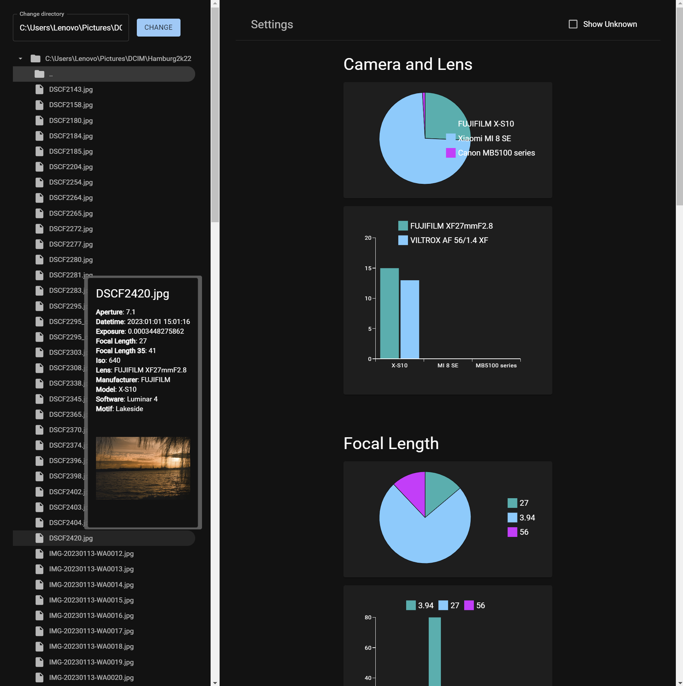
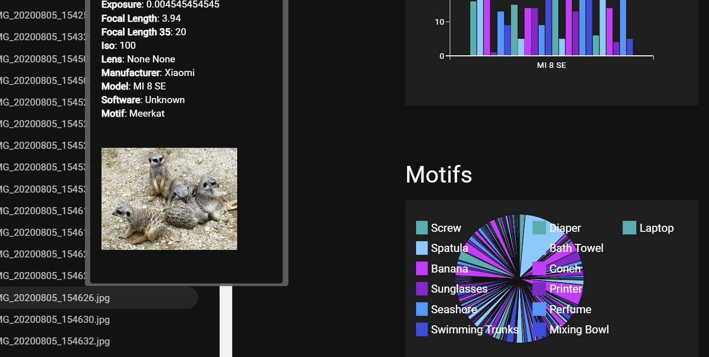

# Photo Analyzer

## Description

This is a small server application for your personal computer that allows you to analyze your photos.

## Features

- Browse through your files and directories
- Shows analytics to all photos (mainly JPEGs) in the current directory and in subdirectories
  - Shows common EXIF data e.g. camera model, exposure time, ISO, aperture, focal length, etc.
  - Shows the motif of the photo (e.g. elephant, car, plant) detected by a neural network

## Installation

- Ensure Python3 is installed
- Just download the source code of the project.

## Usage

- cd into your preferred directory: `cd <path to photos>`
- run the `run.py` script: `python <path to project>\photo-analyzer\run.py`

## Disclaimer

This is made for Windows machines and developed on one.
So the `run.py` might not work on other operating systems.
It requires to make some changes to the `run.py` file or to the `/backend/server.py` file (e.g. changing the path to the ExifTool executable).

I made this project mostly modular but keep in mind this more or less a One-Day-Project.
So there might be some bugs and the code is not cleanest I have ever produced.

## Contribution

Feel free to contribute to this project.

## Development

- All the backend code is in the `/backend` directory
  - Flask server: `/backend/server.py`
  - different services: `/backend/*_services.py`
  - ExifTool executable: `/backend/exiftool.exe`
  - Flask uses the `/frontend/dist` directory as static directory
  - As image recognition I use the ResNet50 model from Keras with the ImageNet weights
- Frontend stuff in the `/frontend` directory
  - React app
  - Typescript (types: `/frontend/src/types/*`)
  - MUI for components and styling

## License

This project is licensed under the **MIT** License - see the [LICENSE](./LICENSE.md) file for details.
